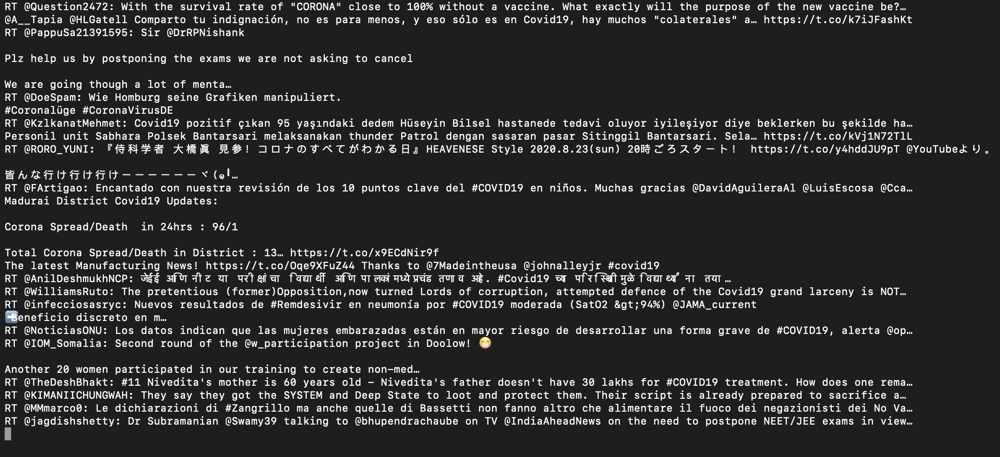

People use Twitter for all kinds of business puposes. And unlike Facebook and other social media platforms, Twitter provides some sort of data freely using the Twitter API.

The Twitter API lets you read and write Twitter data. Thus, you can use it to compose tweets, read profiles, and access your followers' data and a high volume of tweets on particular subjects in specific locations.

In this article we will explore the Twitter Stream API, where we will try to stream near real time tweets that talk about Covid19. We will try to connect this stream to kafka and publish the tweet's text in a topic; which allow subscribed consumers to read data.

### Configuring Kafka

In mac, as in linux, we can use HomeBrew to install kafka.

    $ brew install kafka

After kafka get installed, launch Zookeeper and kafka in different terminal tabs

    $ zookeeper-server-start /usr/local/etc/kafka/zookeeper.properties
    $ kafka-server-start /usr/local/etc/kafka/server.properties

Now let's create a topic named basic

    $ kafka-topics --create --zookeeper localhost:2181 
    --replication-factor 1 --partitions 1 --topic basic

To test that topic, we will initialize a Kafka producer console, which will listen to `localhsot` at port `9092`

    $ kafka-console-producer --broker-list localhost:9092 --topic
    basic
    >it's me
    >elmehdi

and a Kafka consumer that will listen too to `localhost` at port `9092` at the same topic

    $ kafka-console-consumer --bootstrap-server localhost:9092 
    --topic test --from-beginning

    it's me
    elmehdi

And our Kafka is being configures, topic creatd, and both producer and consumer works fine. Now let's connect Twitter to kafka and see the tweets in the consumer

### Connecting twitter API to Kafka

We will be using python in this article, so we have to install somme packages: `kafka-python`, `python-twitter`, and `tweepy`

    pip install kafka-python
    pip install python-twitter
    pip install tweepy

Before starting code, you should get your API access keys from your Twitter API account. If you don't have a dev account, follow the steps mentionned in this article: [How to apply for a Twitter Developer account?](https://www.extly.com/docs/autotweetng_joocial/tutorials/how-to-auto-post-from-joomla-to-twitter/apply-for-a-twitter-developer-account/#apply-for-a-developer-account)

Now we code our little project. First of all you should create auth handler and provide it with the access keys:

    from tweepy import OAuthHandler

    #make sure to keep your access keys secret
    access_token = "(your own)"             
    access_token_secret =  "(your own)"
    api_key =  "(your own)"
    api_secret =  "(your own)"

    auth = OAuthHandler(api_key, api_secret)
    auth.set_access_token(access_token, access_token_secret)

We create a stream listener class that will be responsible for sending data to consumer. in the `on_data` method, you can add the logic you want to apply to the data, for this example I wanted only to stream the tweet text. But keep in mind, that kafka is responsible for streaming and most of time get connected to other applications that do the processing like apache spark, or to database where data get stored

    from tweepy.streaming import StreamListener
    import json

    class StdOutListener(StreamListener):
    def on_data(self, data):
        json_ = json.loads(data) 
        producer.send("basic", json_["text"].encode('utf-8'))
        return True
    def on_error(self, status):
        print (status)

We create a kafka producer which will be attached to `StdOutListener` that we just created. And we create our stream the will filter the tweet results from the source;

    from tweepy import Stream
    from kafka import KafkaProducer

    producer = KafkaProducer(bootstrap_servers='localhost:9092')
    l = StdOutListener()
    stream = Stream(auth, l)
    stream.filter(track=["covid19", "corona virus"])

As a result, this how the consumer console looks like:

Full code:

    from tweepy.streaming import StreamListener
    from tweepy import OAuthHandler
    from tweepy import Stream
    from kafka import KafkaProducer
    import json

    access_token = "--"
    access_token_secret =  "--"
    api_key =  "--"
    api_secret =  "--"
    class StdOutListener(StreamListener):
        def on_data(self, data):
            json_ = json.loads(data) 
            producer.send("basic", json_["text"].encode('utf-8'))
            return True
        def on_error(self, status):
            print (status)

    producer = KafkaProducer(bootstrap_servers='localhost:9092')
    l = StdOutListener()
    auth = OAuthHandler(api_key, api_secret)
    auth.set_access_token(access_token, access_token_secret)
    stream = Stream(auth, l)
    stream.filter(track=["covid19", "corona virus"])

I hope you find this article helpful.